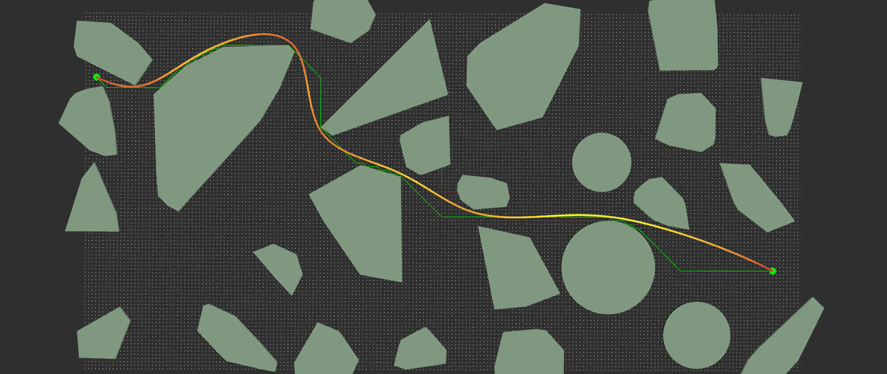
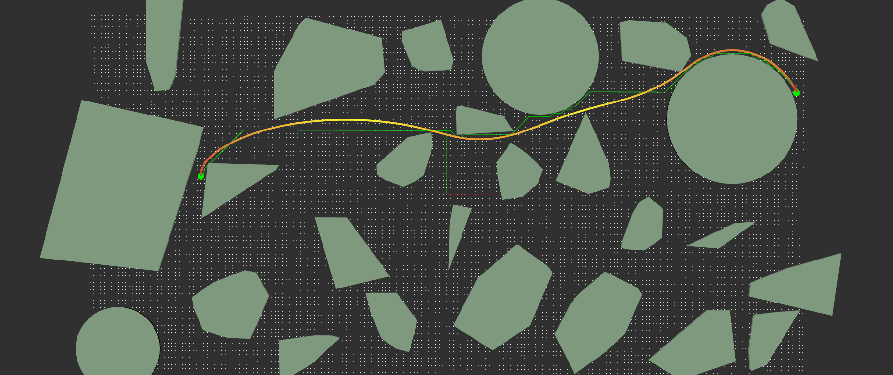
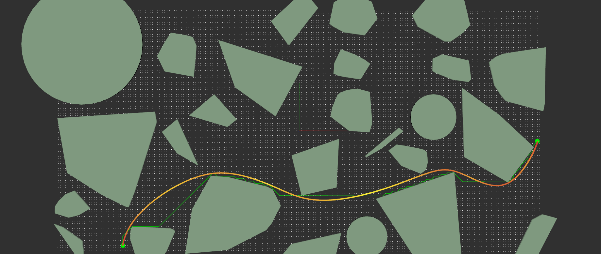
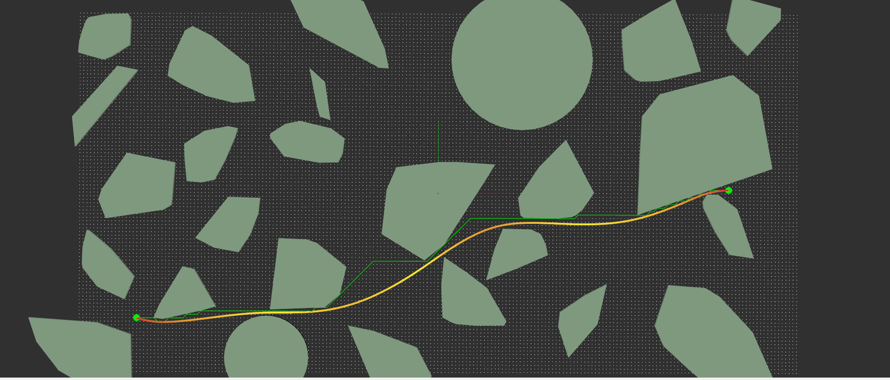
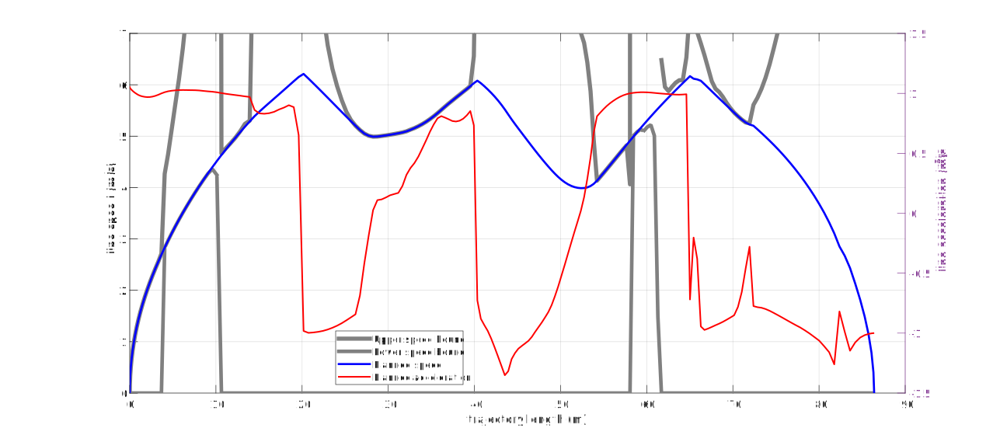

# Numerical Optimization in Robotics - Homework5 
### by tkalpha, 2022.08.31 V0.2.1

Course Link ： [深蓝学院_机器人中的数值优化](https://www.shenlanxueyuan.com/course/573)

## 作业目标以及完成思路
1. 点离凸多边形的最短距离求解
   - 采用Pavel Valtr算法生成随机的凸多边形。
   - 采用随机采样方法生成场景中的凸多边形与圆形障碍物。
   - 在进行最短距离与距离梯度计算前判断点是否在多边形内。
     - 如果点在凸多边形内，直接取点到N边直线的最短距离即可。
     - 如果点在凸多边形外，构建二次规划问题，然后使用SDQP算法求解最短距离点。
2. 无碰撞的轨迹优化生成
   - 在场景中构建搜索栅格，然后使用Astar算法搜索初始最短可行轨迹
   - 在初始轨迹上等距离取点得到三次样条曲线的中间点，进而将初始轨迹拟合为三次样条曲线
   - 将无碰撞平滑轨迹生成任务构建无约束优化问题
     - 路径的平滑优化目标取三次样条曲线的Stretch Energy
     - 路径的无碰撞目标为路径点在场景中离障碍物的最近距离的指数函数
     - 采用L-BFGS算法求解无约束的优化问题
3. 构建SOCP形式的TOPP问题并进行求解
   - 按照课堂讲解内容构建SOCP形式的TOPP问题。
   - 设计优化问题目标函数及其导数的计算方式，其中对二阶锥约束，等式约束与不等式约束分别进行了增广拉格朗日项的设计。
   - 自行设计conic PHR-ALM算法流程求解优化目标。
   - 采用L-BFGS算法作为内层优化器求解conic PHR-ALM算法中的无约束优化问题。

## 作业程序的运行
### 编程环境
Ubuntu MATE 20.04.4 LTS / GCC 9.4.0 / C17标准 / CMake 3.16.3 / ROS Noetic / Vscode 1.70.0 / Eigen 3.4.0
### 作业工程的编译与运行方式

```
catkin_make
source devel/setup.sh
roslaunch sl_hw5 main.launch
```
## 效果展示
1. 图中的白色格点为Astar算法的搜索空间。
2. 淡绿色的实心多边形为随机生成的多边形或者圆形障碍物。两个正绿色圆点为随机生成的路径起始点与终止点。
3. 深绿色路径为Astar算法搜索得到的初始路径。
4. 从红色到黄色渐变的曲线为经过L-BFGS无约束优化与conic ALM TOPP问题求解以后得到的最终路径。曲线颜色越接近浅黄色代表此时轨迹的速度越高；曲线的颜色越接近深红色代表此时的速度越低。
5. 可以发现L-BFGS无约束优化方法生成的路径无碰撞且较为平滑，采用新的势场目标函数以后生成路径不再紧贴障碍物而是会在条件允许的情况下与障碍物保持一定的距离。

以下仅给出部分程序运行结果作为示例。附件提供了18份不同的程序运行结果，详见作业压缩包的results文件夹。
例1

例2

例3

例4

进一步绘制例4的线速度、线加速度曲线以及速度约束的曲线如下图所示。可以发现TOPP规划的结果符合速度约束要求：在轨迹曲率较大的地方速度较低而在轨迹曲率较小的地方速度较高。具体计算分析过程详见 results/v2_19/process.m 

因此可以认为作业程序实现了期望的功能。

## sl_hw5包中的主要程序文件简介
- include 文件夹
  - lbfgs 文件夹
    - lbfgs.hpp 作业2中使用的基于Eigen的L-BFGS算法程序
  - ros1_disp 文件夹
    - rviz_dis.hpp 对rviz1显示功能的封装，提供障碍物与路径曲线绘制等基本功能
    - scene_dis.hpp 运动规划场景以及Astar图搜索结果的绘制显示
    - spline_opt_dis.hpp 三次样条曲线插值与无约束优化结果的显示
    - topp_dis 最终生成轨迹的显示，以及规划结果的文件记录
  - scene文件夹
    - pavel_valtr.hpp Pavel Valtr算法，用于在给定参数下随机生成多边形
    - scene_astar.hpp 运动规划场景地图构建，障碍物与起止点随机生成，Astar初始路径规划
    - scene_base.hpp 提供scene_astar.hpp中sceneAstar类的基类，是对人工距离势场规划问题的抽象，用于后续功能拓展
    - scene_obstacles.hpp 提供不同种类障碍物的生成方法。提供点是否处于障碍物内的判断方法以及点到不同种类障碍物最近距离的计算方法。
  - sdqp文件夹
    - sdqp.hpp Low-dimentional QP问题求解算法，曾用于作业3与作业4
  - traj_optim 文件夹
    - conic_alm_topp.hpp TOPP问题的conic PHR-ALM求解算法，相对作业4的通用conicALM算法采用了不同的内层优化方法，并针对TOPP问题进行了优化简化了计算
    - spline_opt.hpp 对初始规划轨迹的三次样条曲线插值方法。对三次样条曲线基于障碍物距离场的无约束优化方法
- launch 文件夹
  - rviz_config 文件夹，包含工程采用的rviz配置文件
  - main.launch 工程主项目的ROS launch配置文件
- src 文件夹
  - main.cpp 主程序运行入口，提供以上所有方法的运行示例
